

<table class="menlist">
<tr><th>Count     </th><th>  Text        </th><th>    Exemplar  </th><th> SMUFL codepoint </th><th> Graphical </th></tr>
<tr><td> 6775     </td><td>    C|        </td><td>   <a href="http://josquin.stanford.edu/data?a=notation&f=Jos2721">Jos2721</a>        </td><td>   &amp;#xe918;					</td><td> 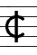	</td></tr>
<tr><td> 2198     </td><td>    O         </td><td>   <a href="http://josquin.stanford.edu/data?a=notation&f=Jos2405">Jos2405</a>        </td><td>  &amp;#xe911;						</td><td> 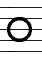		</td></tr>
<tr><td> 1194     </td><td>    C         </td><td>   <a href="http://josquin.stanford.edu/data?a=notation&f=Mar2020">Mar2020</a>        </td><td>  &amp;#xe195;						</td><td> 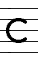		</td></tr>
<tr><td>  921     </td><td>    3         </td><td>   <a href="http://josquin.stanford.edu/data?a=notation&f=Mar3020">Mar3020</a>        </td><td>  &amp;#xe928;						</td><td> 		</td></tr>
<tr><td>  702     </td><td>    C2        </td><td>   <a href="http://josquin.stanford.edu/data?a=notation&f=Rue1004b">Rue1004b</a>      </td><td>  &amp;#xe915;&amp;#xe927;				</td><td> 		</td></tr>
<tr><td>  333     </td><td>    O|        </td><td>   <a href="http://josquin.stanford.edu/data?a=notation&f=Rue1005e">Rue1005e</a>      </td><td>   &amp;#xe912;					</td><td> 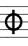	</td></tr>
<tr><td>  193     </td><td>    C|3       </td><td>   <a href="http://josquin.stanford.edu/data?a=notation&f=Rue1007d">Rue1007d</a>      </td><td>   &amp;#xe918;&amp;#xe928;				</td><td> 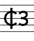	</td></tr>
<tr><td>  155     </td><td>    O/3       </td><td>   <a href="http://josquin.stanford.edu/data?a=notation&f=Jap3009">Jap3009</a>        </td><td>  &amp;#e911; over &amp;#xe928;			</td><td> 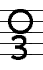		</td></tr>
<tr><td>  139     </td><td>    O2        </td><td>   <a href="http://josquin.stanford.edu/data?a=notation&f=Jos0401d">Jos0401d</a>      </td><td>  &amp;#xe911;&amp;#xe927;				</td><td> 		</td></tr>
<tr><td>  101     </td><td>    C3        </td><td>   <a href="http://josquin.stanford.edu/data?a=notation&f=Gas2017a">Gas2017a</a>      </td><td>  &amp;#xe915;&amp;#xe928;				</td><td> 		</td></tr>
<tr><td>   64     </td><td>    C.        </td><td>   <a href="http://josquin.stanford.edu/data?a=notation&f=Bus1001a">Bus1001a</a>      </td><td>  &amp;#xe914;						</td><td> 		</td></tr>
<tr><td>   50     </td><td>    O.        </td><td>   <a href="http://josquin.stanford.edu/data?a=notation&f=Bus1001b">Bus1001b</a>      </td><td>  &amp;#xe910;						</td><td> 		</td></tr>
<tr><td>   29     </td><td>    3/2       </td><td>   <a href="http://josquin.stanford.edu/data?a=notation&f=Jos1903">Jos1903</a>        </td><td>  &amp;#e928; over &amp;#e927;				</td><td> 		</td></tr>
<tr><td>   26     </td><td>    O3        </td><td>   <a href="http://josquin.stanford.edu/data?a=notation&f=Bru2012">Bru2012</a>        </td><td>  &amp;#xe911;&amp;#xe928;				</td><td> 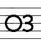 not in musedata typesetter</td></tr>
<tr><td>   21     </td><td>    C|2       </td><td>   <a href="http://josquin.stanford.edu/data?a=notation&f=Ort2004">Ort2004</a>        </td><td>   &amp;#xe918;&amp;#xe927;				</td><td> 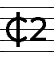 </td></tr>
<tr><td>   17     </td><td>    2         </td><td>   <a href="http://josquin.stanford.edu/data?a=notation&f=Jos0402e">Jos0402e</a>      </td><td>  &amp;#xe927;						</td><td> 		</td></tr>
<tr><td>   13     </td><td>    O3/2      </td><td>   <a href="http://josquin.stanford.edu/data?a=notation&f=Tin1001c">Tin1001c</a>      </td><td>  &amp;#xe911;&amp;#xe928; over &amp;#xe927;		</td><td> 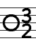		</td></tr>
<tr><td>   10     </td><td>    O|3/2     </td><td>   <a href="http://josquin.stanford.edu/data?a=notation&f=Jos0903b">Jos0903b</a>      </td><td>   &amp;#xe912;&amp;#xe928; over &amp;#xe927;		</td><td> 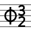		</td></tr>
<tr><td>   10     </td><td>    O|3       </td><td>   <a href="http://josquin.stanford.edu/data?a=notation&f=Jos0406b">Jos0406b</a>      </td><td>   &amp;#xe912;&amp;#xe928;				</td><td> 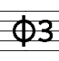		</td></tr>
<tr><td>    8     </td><td>    C.|       </td><td>   <a href="http://josquin.stanford.edu/data?a=notation&f=Ock1013e">Ock1013e</a>      </td><td>   &amp;#xe917;					</td><td> 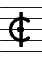 </td></tr>
<tr><td>    8     </td><td>    C.3/2     </td><td>   <a href="http://josquin.stanford.edu/data?a=notation&f=Mar2079">Mar2079</a>        </td><td>  &amp;#xe914;&amp;#x3928; over &amp;#xe927;		</td><td> 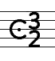		</td></tr>
<tr><td>    7     </td><td>    Cr        </td><td>   <a href="http://josquin.stanford.edu/data?a=notation&f=Rue1001b">Rue1001b</a>      </td><td>  &amp;#xe916;						</td><td> 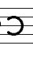		</td></tr>
<tr><td>    6     </td><td>    C|/3      </td><td>   <a href="http://josquin.stanford.edu/data?a=notation&f=Jos0406d">Jos0406d</a>      </td><td>   &amp;#e918; over &amp;#xe928;			</td><td> 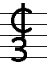		</td></tr>
<tr><td>    4     </td><td>    C|/2      </td><td>   <a href="http://josquin.stanford.edu/data?a=notation&f=Jos0902d">Jos0902d</a>      </td><td>   &amp;#xe918; over &amp;#xe927;			</td><td> 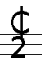		</td></tr>
<tr><td>    4     </td><td>    C2/3      </td><td>   <a href="http://josquin.stanford.edu/data?a=notation&f=Tin1001b">Tin1001b</a>      </td><td>  &amp;#xe918;&amp;#e927; over &amp;#xe928;		</td><td> 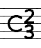		</td></tr>
<tr><td>    4     </td><td>    2/1       </td><td>   <a href="http://josquin.stanford.edu/data?a=notation&f=Tin1001a">Tin1001a</a>      </td><td>  &amp;#xe927; over &amp;#xe926;			</td><td> 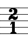		</td></tr>
<tr><td>    3     </td><td>    C|r       </td><td>   <a href="http://josquin.stanford.edu/data?a=notation&f=Bus1001c">Bus1001c</a>      </td><td>   &amp;#xe919;					</td><td> 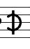		</td></tr>
<tr><td>    2     </td><td>    4/3       </td><td>   <a href="http://josquin.stanford.edu/data?a=notation&f=Tin2001">Tin2001</a>        </td><td>  &amp;#xe929; over &amp;#xe928;			</td><td>  not in musedata typesetter		</td></tr>
<tr><td>    1     </td><td>    C.3/8     </td><td>   <a href="http://josquin.stanford.edu/data?a=notation&f=Tin1001e">Tin1001e</a>      </td><td>  &amp;#xe914;&amp;#xe928; over 8 (no "8" mensural glyph)	</td><td> 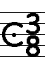		</td></tr>
<tr><td>    1     </td><td>    6/4       </td><td>   <a href="http://josquin.stanford.edu/data?a=notation&f=Tin3006">Tin3006</a>        </td><td>  6 over &amp;#xe929;					</td><td>  not in musedata typesetter		</td></tr>
<tr><td>    1     </td><td>    2/3       </td><td>   <a href="http://josquin.stanford.edu/data?a=notation&f=Tin2001">Tin2001</a>        </td><td>  &amp;#e927;      over &amp;#xe928;			</td><td>  not in musedata typesetter		</td></tr>
<tr><td>    1     </td><td>    14/18     </td><td>   <a href="http://josquin.stanford.edu/data?a=notation&f=Tin3006">Tin3006</a>        </td><td>  &amp;#xe296;&amp;#xe929; over &amp;#xe926;8		</td><td>  not in musedata typesetter		</td></tr>
</table>

